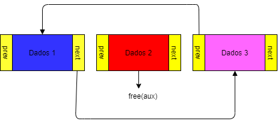
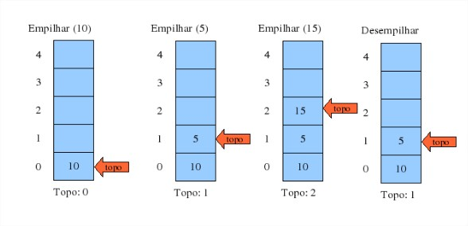
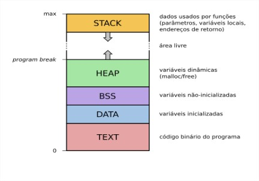

<h2>&nbsp &nbsp &nbsp &nbsp1. Listas</h2>

<p>&nbsp &nbsp &nbspQuando trata-se de listas, o conceito na teoria faz parte do cotidiano. Basicamente, são informações organizadas da forma que deseja uma seguinte da outra seja em papel ou, sistema no qual um dos diversos objetivos seria anotar para lembrar-se de algo posteriormente.</p>
<p>&nbsp &nbsp &nbspReferindo-se à Listas ligada ou encadeada no âmbito da Estrutura de Dados, a mesma é composta por células que apontam para o próximo elemento da lista no qual todos, sabem qual é o elemento posterior. Usualmente, este conjunto (elemento e próximo) são denominados “nós” ou <em>node</em>. Na programação em C, para desenvolver a lógica do nó em uma lista encadeada, é necessário que haja um ponteiro para o próximo elemento este que por sua vez, necessita estar atrelado a um <em>struct</em> (estrutura). Quando a lista está vazia, o primeiro (<em>head</em>) e o último (<em>tail</em>) elemento apontam para <em>null</em> e a partir do momento que a lista for populada, o seu último elemento ainda apontará para nulo.</p>

```
Célula 1 ---> Célula 2 ---> Célula 3 ---> Célula 4 ---> (Nulo)
```

<p>&nbsp &nbsp &nbspJá na lista duplamente encadeada, o que diferencia da somente lista encadeada é que torna-se possível a leitura do elemento anterior para realizar diferentes tipo de operações como por exemplo, deletar um elemento do meio da lista. Sendo assim, a utilização de um ponteiro para o nó anterior se faz necessário. Outro detalhe importante para a utilização de listas, é a utilização da alocação dinâmica de memória que, é feita através da função malloc.</p>

```
void *malloc(size_t size)
```
<p>&nbsp &nbsp &nbspNesta função, é necessário que seja alocado o tamanho do node (<em>struct</em>) em conjunto com o ponteiro declarado na própria estrutura e assim, alocando a memória para o elemento no qual é uma boa prática realizar esse processo utilizando o <em>sizeof</em>, este que retorna o tamanho de um tipo de dado em vez de calcular o tamanho dos <em>bytes</em> de cada variável para realizar a alocação.</p>
<p>&nbsp &nbsp &nbspPara realizar a exclusão do primeiro elemento da lista, é necessário criar uma variável auxiliar que armazene os dados do primeiro elemento onde até essa etapa, haverá duas variáveis apontando para o mesmo local na memória. Após isso, o _head_ terá que apontar para o elemento posterior ao que será excluído. Para isso, basta utilizar a função free() no auxiliar para que ocorra a exclusão e libere o espaço alocado na memória. Para excluir o último elemento, a lógica é semelhante ao de excluir o primeiro porém neste caso, o <em>head</em> será o <em>tail</em> e o <em>next</em> (próximo) será o <em>previous</em> (anterior) no qual apontará para o antepenúltimo elemento da lista.</p>
<p>&nbsp &nbsp &nbspJá para realizar a exclusão de um elemento do meio da lista, é necessário que o anterior do próximo que será excluído aponte para o anterior (do excluído) e que o próximo de seu anterior aponte para seu próximo. Segue esquema abaixo exemplificando este processo:</p>



<h2>&nbsp &nbsp &nbsp &nbsp2. Pilhas</h2>

<p>&nbsp &nbsp &nbspO conceito de Pilhas é um dos mais úteis na computação. Nas Pilhas, os elementos são inseridos (<em>push</em>) no topo e removidos (<em>pop</em>) somente do topo. Trazendo também consigo o conceito de LIFO (<em>last in, first out</em>) que significa último a entrar, primeiro a sair. As Pilhas também podem ser implementadas em listas encadeadas ou vetores. No caso de uma lista encadeada, é necessário ter uma referência ao elemento no topo da lista enquanto nos vetores, é indicada a posição da variável no qual é costumeiro saber o tamanho máximo de elementos a ser armazenado.</p>



<p>&nbsp &nbsp &nbspAo criar uma pilha, deve ser feita uma função que aloca a memória dinamicamente a estrutura instaurando o seu começo e retornando seu ponteiro. Na estrutura de pilha utilizando vetores, é necessário que haja um vetor para armazenamento dos dados no qual vet[n - 1] representa o elemento do topo onde n é a quantidade de elementos.</p>
<p>&nbsp &nbsp &nbspAo criar a pilha, é alocada dinamicamente a estrutura utilizando o malloc assim como nas Listas. Do mesmo modo que inicializa vazia e o número de elementos (n) é igual à 0 e caso a lista esteja vazia, consequentemente a pilha estará também. Ao inserir, é utilizada a próxima posição livre do vetor enquanto a função para retirar do topo, concede seu valor como retorno. Na estrutura de Pilhas utilizando lista encadeada, é usual quando não sabe-se o máximo de elementos à ser armazenado.</p>
<p>&nbsp &nbsp &nbspSendo assim, com os elementos armazenados na lista haverá um ponteiro para o próximo node da lista ou, elemento da pilha. É preciso duas funções auxiliares da lista para inserir e remover do topo. Já na função que libera a pilha, antes deve-se eliminar os elementos da lista.</p>

<h2>&nbsp &nbsp &nbsp &nbsp3. Alocação de Memória</h2>
	
<p>&nbsp &nbsp &nbspNa linguagem C, há três formas de alocação de memória: alocação estática, automática e dinâmica. Na alocação estática, são declaradas variáveis globais (fora de funções) ou, quando trata-se de variáveis locais, utiliza-se o <em>static</em>. Com isso, mantém o mesmo valor durante todo o programa. Sendo assim, são alocadas uma única vez preservando seus valores entre as chamadas das funções.</p>
<p>&nbsp &nbsp &nbspNa alocação automática, por padrão (<em>default</em>), as variáveis locais são alocadas automaticamente na pilha de execução do programa (<em>stack</em>) em cada chamada de função e sendo descartada quando a mesma se encerra. O que pode ocorrer neste tipo de alocação é que, como a pilha de execução geralmente é pequena, quando aloca-se variáveis locais muito grandes, pode resultar em erros. Para isso, é interessante nestes casos que seja utilizado variáveis estáticas ou dinâmicas.</p>
<p>&nbsp &nbsp &nbspJá na alocação dinâmica, é solicitado explicitamente à áreas da memória do Sistema Operacional no qual, quando não estiver mais sendo utilizado, é liberado o espaço ou quando o programa se encerrar. Seu uso é um dos mais comuns visto que, otimiza programas deixando-os mais rápidos e utiliza menos espaço da memória. As alocações dinâmicas são destinadas à uma área da memória chamada heap. Neste modo, é utilizado a chamada malloc (<em>Memory Allocation</em>) para realizar a alocação no qual disponibiliza uma área de acordo com o tamanho dos <em>bytes</em> retornando um ponteiro para o início com o endereço do bloco alocado.</p>

'void *malloc(size_t numero_de_bytes);'

<p>&nbsp &nbsp &nbspQuando é retornado este ponteiro, o mesmo não retorna um tipo de dado específico e com isso, é necessário que em vez de declarar como void, é importante que essa tipagem seja definida na função.</p>
<p>&nbsp &nbsp &nbspTambém, é necessário a utilização da função free(), para liberação do que já foi alocado previamente. Uma boa prática é a utilização do sizeof pois, como variáveis possuem diferentes valores, com esta função a alocação será precisa de acordo com a máquina que está compilando o programa.</p>



